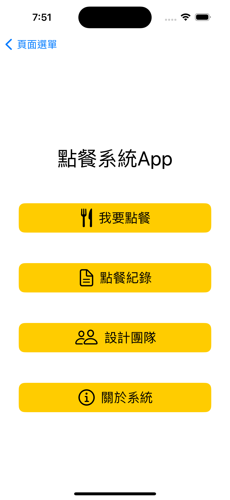

# Ordering System App

    
    
    

## Overview

This project is a mobile ordering system built using SwiftUI. It allows users to browse a menu, place orders, and track their order status in real-time.

## Features

- **User Authentication**: Secure login and registration for users.
- **Menu Display**: Browse through various categories of food and drinks.
- **Order Management**: Add items to the cart and place orders easily.
- **Real-time Updates**: Receive notifications about order status.
- **Profile Management**: Update user profiles and view order history.

## Technologies Used

- SwiftUI for the user interface
- Combine for reactive programming
- Core Data for local data persistence
- Firebase for backend services (authentication and database)
